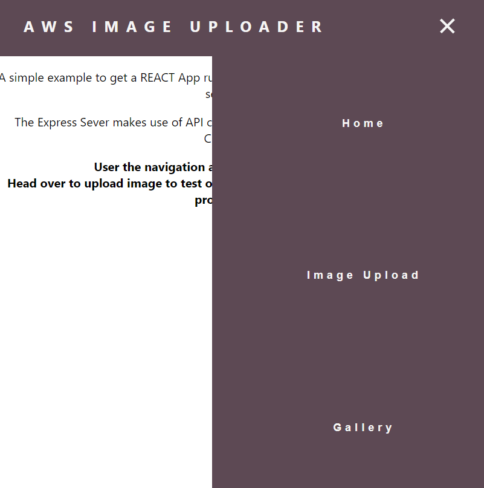

# Final Cloud Computing Class

## Initial running of install script
- Clone repo
- Chmod install.sh install-app.sh destroy.sh to be +x
- The command parameters are
- It was set up to run in **us-east-1**

> ./install.sh [IMAGE AMI] [DESIRED COUNT] [TYPE] [SSH KEY] [SECURITY GROUP] [USER] [SUBNET1] [SUBNET2] [LAMBDA ROLE ARN]
### Command to run the install script
> $ ./install.sh ami-022e07c2ebf41727f 3 t2.micro acer-kp sg-07618656 inclass-2019 subnet-dcee97e2 subnet-7f4a7f18 arn:aws:iam::338921987459:role/lambda-basic-execution

- Subnet 2 is needed to elbv2 as 2 availability zones are needed
- Lamdba role arn is the role to give Lambda functions: for this the role must have Lambda access, DynamoDB access, SNS Access.

 - Script creates a Autoscaling group to run EC2 instances based on demand
 - Creates Launch Configuration for Autoscaling
 - Creates DynamoDB database
 - Creates and attaches Autoscaling group to Load Balancer
 - Creates SQS Queue
 - Create Lambda function for added to DynamoDB and sending SNS text message
 - Build REACT JS front end, Express NodeJS backend API to interface with the Lambda, S3 buckers, DynamoDB, SQS, SNS

 - Destroy.sh script to destroy instances, launch config, load balancers, SQS, DynamoDB, Lambda, and all other created entities

 ## The Framework 
 
 >The Ubuntu machine initially spins up the autoscaling group behind a load balancer. The web server on instance is Nginx (I used Nginx to work with proxypass to allow nodejs APIs to be called from React app). The front end is in React. Backend is Express/NodeJS to connect cloud services.

 ### Home Page

The React app has a responsive nav bar that will dynamically change if the screen is shrunk, or on mobile.

### The Image Uploader

Fill in the form and select and image.

When file upload there will be an alert. Upon success the user is also sent a text message with SNS

### Gallery

Raw images, email, and filename, and black and white processed images are displayed from the DynamoDB.
> Limitation: The images are displayed from signed s3urls that will only last for 1 hour after upload. Files remain is s3 bucket in base64 form.

> Future Work: Convert the AWS CLI use to CloudFormation. Remove the use of Express API to make entire infrastructure more cloud native. This would be accomplished with AWS API gateway calls to signal Lambdas. In the install script there is the framework to begin using these. But time limitations of this project only allowed to shoehorn Lambda calls into Express API

- Some key take-aways from this project

    - Check the output of AWS because your automation script might need text output, but you changes it to JSON earlier
    
    - The lambda GUI console on AWS is useful to debug the lambda on the fly after creation.

    - Adding swap memory to ec2 instance helped with failing the npm build due to low memory error

### Code Sources
<a href=https://docs.aws.amazon.com/apigateway/latest/developerguide/api-gateway-create-api-as-simple-proxy-for-lambda.html>Build a Hello World API with Lambda Proxy Integration</a>

<a href=https://www.freecodecamp.org/news/building-an-api-with-lambdas-and-api-gateway-part-2-7c674a0eb121/>How to Integrate DynamoDB into your API using AWS Lambda</a>

<a href=https://dev.to/saulojoab/how-to-get-data-from-an-mysql-database-in-react-native-53a4
name="myfootnote1">How to get data from a MySQL database in React</a>

<a href=https://docs.aws.amazon.com/pinpoint/latest/developerguide/tutorials-importing-data-lambda-function-process-incoming.html>Create the Lambda Function That Processes the Incoming Records</a>

<a href=https://www.digitalocean.com/community/tutorials/how-to-set-up-a-node-js-application-for-production-on-ubuntu-18-04>Set up Node.js App for Production</a>

<a href=https://medium.com/@manivannan_data/invoke-lambda-function-from-one-to-another-using-node-js-a6f007322f6c>Invoke Lambda Function from one to another using Node JS</a>

<a href=https://ig.nore.me/2016/03/setting-up-lambda-and-a-gateway-through-the-cli/>Setting up Lambda and a gateway</a>

My total commits for this project was ~150 hopefully most have a clear, concise message... 

